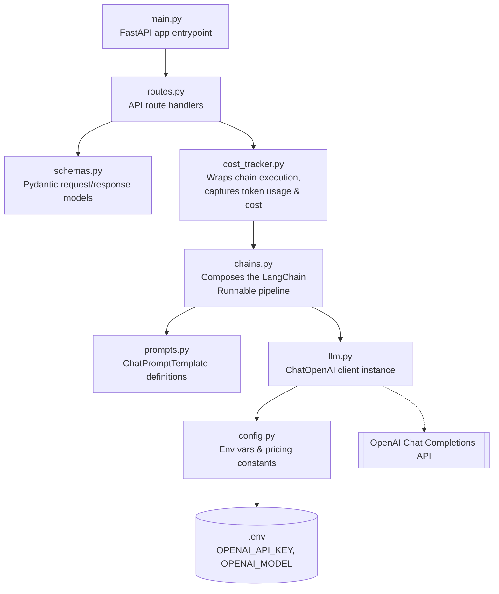

# LLM Query API

A lightweight **FastAPI** service that exposes a single endpoint for querying an OpenAI
chat model through **LangChain**, returning the model's answer together with token
usage and estimated cost for the call.

---

## 1. Overview

| | |
|---|---|
| **Framework** | FastAPI |
| **LLM orchestration** | LangChain (`langchain-core`, `langchain-openai`, `langchain-community`) |
| **Model provider** | OpenAI (default: `gpt-4o-mini`) |
| **Interface** | REST — `POST /query` |
| **Cost tracking** | LangChain's `get_openai_callback` context manager |

The service accepts a natural-language question, runs it through a LangChain
"prompt → LLM → output parser" pipeline, and returns the answer plus token/cost
metrics in a single JSON response.

---


### 2.1 Module responsibilities



This is a clean **layered pipeline**:

- **`main.py`** — creates the FastAPI app and mounts the router.
- **`routes.py`** — HTTP layer; validates input, delegates to the tracker, shapes the response.
- **`schemas.py`** — the API's data contract (`QueryRequest` / `QueryResponse`).
- **`cost_tracker.py`** — cross-cutting concern; wraps any chain invocation with OpenAI usage/cost capture.
- **`chains.py`** — builds the LangChain Runnable (`prompt | llm | output_parser`).
- **`prompts.py`** — prompt templates, kept separate so they can be edited/versioned independently.
- **`llm.py`** — single place where the `ChatOpenAI` client is constructed.
- **`config.py`** — centralizes environment variables and pricing constants; no other module reads `os.environ` directly.

### 2.2 Project structure

```
project/
├── app/
│   ├── main.py            # FastAPI app instance, mounts router
│   ├── routes.py          # /query endpoint
│   ├── schemas.py         # QueryRequest / QueryResponse models
│   ├── chains.py          # LangChain Runnable: prompt | llm | parser
│   ├── prompts.py         # ChatPromptTemplate definitions
│   ├── llm.py             # ChatOpenAI client instance
│   ├── config.py          # env vars + pricing constants
│   └── cost_tracker.py    # token usage / cost wrapper
├── .env                    # local secrets (not committed)
├── requirements.txt
└── README.md
```

---

## 3. Setup

### 3.1 Prerequisites

- Python 3.10+
- An OpenAI API key

### 3.2 Install

```bash
python -m venv venv
source venv/bin/activate      # Windows: venv\Scripts\activate
pip install -r requirements.txt
```

### 3.3 Configure environment variables

Create a `.env` file in the project root:

```env
OPENAI_API_KEY=sk-your-key-here
OPENAI_MODEL=gpt-4o-mini
```

> `config.py` loads these via `python-dotenv`. If `OPENAI_MODEL` is not set, `llm.py`
> will fail since no default is defined — always set it explicitly.

### 3.4 Run

```bash
uvicorn app.main:app --reload
```

The API will be available at `http://127.0.0.1:8000`, with interactive docs at
`http://127.0.0.1:8000/docs`.

---

## 4. API Reference

### `GET /`

Health/welcome check.

```json
{ "message": "Welcome to the LLM Query API!" }
```

### `POST /query`

**Request body**

```json
{
  "question": "What is the capital of France?"
}
```

**Response body**

```json
{
  "answer": "The capital of France is Paris.",
  "prompt_tokens": 24,
  "completion_tokens": 8,
  "total_tokens": 32,
  "estimated_cost": 0.0000084
}
```

**Example**

```bash
curl -X POST http://127.0.0.1:8000/query \
  -H "Content-Type: application/json" \
  -d '{"question": "What is the capital of France?"}'
```

---

## 5. Design notes

- **Separation of concerns**: prompt design (`prompts.py`), model configuration
  (`llm.py`), pipeline composition (`chains.py`), and execution/observability
  (`cost_tracker.py`) are all independent modules, so any one of them can be
  swapped without touching the others (e.g. changing the prompt doesn't require
  touching the route, and swapping providers only touches `llm.py`).
- **Cost tracking** is generic — `execute_chain(chain, question)` works with any
  chain, not just `query_chain`, so new endpoints can reuse it.
- **Pricing constants** in `config.py` (`INPUT_PRICE_PER_MILLION`,
  `OUTPUT_PRICE_PER_MILLION`) are currently unused by `cost_tracker.py`, which relies
  on LangChain's built-in OpenAI pricing table via `get_openai_callback`. Keep this
  in mind if you switch models — LangChain's callback only has built-in pricing for
  a subset of OpenAI models.

